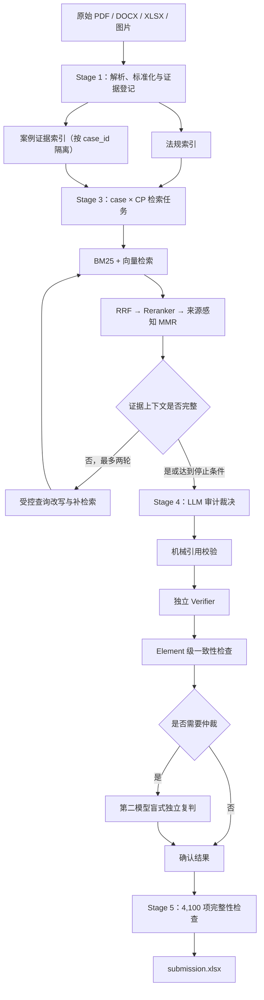

# FRECA Task 2 最终技术方案

> 实现补充（2026-07-20）：通过 `freca.signatures` 接入用户调研表，落地 Track 内污染证据识别 → 索引隔离 → 裁决拒绝污染 supporting → Element 级 _establishment_name 一致性检查。所有改动通过 92 个单元测试。

> 版本：v3.1  
> 日期：2026-07-20  
> 状态：当前权威方案  
> 范围：从原始数据解析到 `submission.xlsx` 的端到端设计

本文档替代旧版 `SOLUTION.md`。旧版中“仅审计 96 个案例，并将 4 个结构异常案例整案填为 `N/A`”的策略正式废弃。

## Architecture status — 2026-07-28

This document preserves the legacy retrieval-heavy pipeline for compatibility and historical evidence. The active architecture for new evaluation work is the direct LLM experiment framework described in `docs/superpowers/specs/2026-07-28-freca-direct-llm-experiment-design.md`.

Its baseline sends the official checkpoint text, full policy, and all official evidence for the current case directly to an LLM. The FRECA evidence is text and tables only (no images exist across the 898 source files), so the multimodal image path is tested but inert for this dataset. The comparison portfolio changes only execution granularity and automatic retrieval: `case_full`, `element_full`, `checkpoint_full`, and `automatic_retrieval`. It does not use `signature_truth`, manual CP-to-rule mappings, hand-authored compliance rules, or automatic `N/A` filling. A frozen LLM reference is a silver comparator only, not ground-truth accuracy.

Track 3 carries an `Audit scenario:` near-answer narrative; `materialize --track3 raw|masked` runs either condition so the leakage effect can be measured rather than silently exploited. `checkpoint_full` is 41× the per-case cost of `case_full`, so `experiment cases --limit N` bounds it to a sample.

`freca experiment plan` is provider-free and writes deterministic units. The underlying execution API records every request, source hash, raw response, verdict validation, and image list. A real run remains explicitly gated and is not exercised by tests.

---

## 1. 结论

本项目采用以下主线：

> **结构化解析 → 法规与案例证据双索引 → CP 级混合检索与有限纠错 → LLM 审计裁决 → 引用验证、独立复核与选择性仲裁 → 提交结果**

系统对 **100 个逻辑案例 × 41 个检查点**分别运行，共产生 **4,100 个裁决任务**。任何案例都不会仅因缺文件、目录混装、编号冲突或解析失败而整案写成 `N/A`。

本方案的核心原则是：

1. `case_id` 是唯一主键，RE Number 只是可能重复的业务属性。
2. 原始证据永远保留；结构化文本、OCR 和视觉描述都是可追溯的派生产物。
3. CP 要求必须在运行时从官方 CP 原文和法规中检索、推导，不手工硬编码到提示词。
4. `N/A` 只表示业务上不适用，不表示证据缺失、系统失败或模型不确定。
5. 质量控制优先拦截跨案例污染、虚假引用和证据不支持的结论。
6. 全流程可中断、可恢复、可追踪、可复跑；不承诺外部模型 API 能逐字节复现相同输出。

---

## 2. 已知数据事实与处理决策

### 2.1 已核实的数据事实

- 数据包可恢复 `case_id=1..100` 的 100 个逻辑案例。
- 理论上应有 900 份 Track 文件，实际为 898 份。
- case 24 和 case 80 缺少 Track 1。
- `RE-WA-2021-0077` 目录同时包含 case 35 和 case 100 的材料；同一 RE Number 对应两个逻辑案例。
- Track 3 内部存在系统性的 RE Number 错位和接近答案的文字字段。
- 案例材料可能不完整、含糊或互相矛盾；这些内容必须保留为审计证据，不能在清洗阶段擅自修正。
- 当前 `submission_template.xlsx` 只有表头，没有官方预填的 100 行案例标识。

### 2.2 操作决策：标记并继续

组委会未对数据矛盾另行答复，因此本项目统一采用 `flag_and_continue`：

1. 按 `case_id=1..100` 清洗、索引和逐 CP 审计，不采用 96 案例筛选。
2. case 24/80 缺 Track 1、case 35/100 共用 RE Number、Track 3 内部编号错位和模板仅有表头，均在首次清洗报告中显式标记。
3. 不修正原始证据，不删除异常案例，不因缺文件或编号冲突自动生成 `N/A`。
4. `case_id` 始终作为内部唯一主键；RE Number 仅作为保留原值的业务属性。
5. Track 3 中接近答案的字段保留为带来源的原始材料，但必须经过正常检索、交叉验证和引用门禁，不能直接当标签复制。

这些数据质量问题不阻断解析、索引、检索和审计。正式写表仍必须满足 4,100 项完整性与质量门禁；在官方行标识口径仍不明确时，输出标记为候选结果，不能声称已经获得组委会格式确认。

---

## 3. 总体架构



整个系统是离线批处理流水线。各 Stage 之间通过落盘产物解耦，每个 `case_id × cp_id` 任务独立记录状态并可单独重跑。

---

## 4. Stage 1：数据解析与标准化

### 4.1 解析规则

| 来源 | 解析方式 | 必须保留的信息 |
|---|---|---|
| 法规 PDF | MinerU 输出 JSON 和 Markdown；必要时保留页面渲染图 | 原始页码、章节、条款层级、表格、页内顺序 |
| Word | 原生 OOXML / Word 解析器提取标题、段落、表格、页眉页脚和嵌入对象 | 段落序号、表格行列、对象关系、原文件位置 |
| Excel | 原生读取 workbook、sheet、单元格值、公式和显示值 | Sheet、行列坐标、日期类型、空值、合并单元格、公式 |
| 图片/图形 | 提取原图，视觉模型生成中性描述 | 原图、所在文件/页、对象编号、描述模型与提示词 |

视觉描述只用于召回和辅助理解，不能替代原始图像。凡是裁决依赖空间位置、设施存在性、边界或图例，审计上下文必须能够回到原图。

### 4.2 案例归属

- `case_id` 优先从带编号的文件名和已核实的案例清单恢复。
- RE 目录名、文件正文中的 RE Number、企业名和地址都作为属性及冲突证据，不作为唯一主键。
- 混合目录必须拆成两个独立的逻辑案例，但保留二者共享目录和 RE Number 的事实。
- 不得因 Track 3 内部编号与目录不一致而静默覆盖原值；两者都应保存，并标记来源。

### 4.3 统一证据片段 Schema

```json
{
  "chunk_id": "case-035_t3_sheet-PestActivity_rows-12-18",
  "case_id": 35,
  "re_number": "RE-WA-2021-0077",
  "track": 3,
  "source_file": "3_PestControlRecord_35_....xlsx",
  "source_type": "xlsx",
  "location": {
    "page": null,
    "section": null,
    "sheet": "Pest Activity Log",
    "cell_range": "A12:H18",
    "object_id": null
  },
  "content": "...",
  "content_kind": "table",
  "derived_from": null,
  "parser": {
    "name": "...",
    "version": "..."
  },
  "source_sha256": "...",
  "flags": ["internal_re_conflict"]
}
```

法规片段使用相同的来源与定位字段，但将 `case_id` 和 `track` 设为空，并增加法规版本、章节和条款字段。

### 4.4 清洗边界

允许：

- 统一 Unicode、空白和可逆的日期表示；
- 展开合并单元格时保留原始结构；
- 标注文件缺失、字段冲突、语言和解析质量；
- 将表格和图片生成可检索的派生文本。

禁止：

- 静默改正企业名、RE Number、日期或结论性字段；
- 将 `Audit scenario` 等字段直接转换为 CP 标签；
- 在清洗阶段把缺失或冲突材料判断为 `0` 或 `N/A`；
- 丢弃与其他文件矛盾的证据。

---

## 5. Stage 2：法规与案例证据双索引

### 5.1 法规索引

法规索引包含：

- 政策 PDF 的条款、定义、例外、适用条件和交叉引用；
- 官方 CP1–CP41 原文及 Element 上下文；
- 原始页码、章节和版本信息。

CP 原文可以作为查询种子，但不得人工补入预先解释好的合规规则。法规要求必须由检索结果在运行时支持。

### 5.2 案例证据索引

案例索引包含每个案例 Track 1–9 的证据片段和派生描述。所有查询必须带不可省略的 `case_id` 过滤条件：

```text
search_case_evidence(query, case_id, allowed_tracks?, content_kinds?)
```

检索接口返回结果后还要再次校验 `result.case_id == requested_case_id`。任何跨案例结果都视为严重错误并阻断该任务。

### 5.3 混合检索

两套索引都使用：

1. BM25：覆盖规则编号、专有名词、日期、表头和精确字段；
2. 向量检索：覆盖语义近似、转述和跨文档表达；
3. 结果保留各自的原始分数、排名和查询版本。

索引构建记录 embedding 模型、分块参数、索引版本和输入文件哈希。法规索引与案例索引不得混存为一个无过滤集合。

---

## 6. Stage 3：每个案例、每个 CP 独立检索

### 6.1 任务单元

唯一任务键为：

```text
run_id + case_id + cp_id
```

系统创建 4,100 个任务。每个任务只读取当前案例证据和当前 CP 所需的法规上下文。

### 6.2 查询构造

初始查询由以下输入自动构造：

- 当前 CP 的官方原文；
- 所属 Element 的官方标题；
- 法规检索中需要识别的适用条件、义务、例外和时间要求；
- 案例检索中需要寻找的主体、设施、记录、日期、状态和反证。

查询模板只能描述通用审计动作，不能人工写入某个 CP 的正确规则或答案。

### 6.3 排序与上下文选择

候选结果依次经过：

1. **RRF 融合**：合并 BM25 与向量检索排名；
2. **Reranker 精排**：分别评估片段与当前 CP 查询的相关性；
3. **来源感知 MMR**：在相关性、去重和来源多样性之间取平衡；
4. **上下文预算控制**：确保法规片段与案例证据分别保留，不因某一来源过多而挤掉另一类来源。

来源感知 MMR 应优先覆盖不同 Track、不同 Sheet/章节以及支持和反对两类证据，而不是只选措辞相近的片段。

### 6.4 有限纠错检索

初次检索后，系统检查上下文是否覆盖：

- 适用范围与例外；
- 主体和注册业务；
- 必要记录、设施或程序；
- 时间、频率、留存期等限制；
- 支持证据和潜在反证；
- 已发现的跨文档冲突。

若缺失，Agent 必须明确指出缺口类型并改写查询。最多补充两轮；每轮的查询、理由和新增片段全部落盘。

停止条件：

- 已覆盖法规要求和足够的正反证据；或
- 连续一轮没有新增有效片段；或
- 已达到两轮上限。

达到上限后不得继续循环。检索不足会降低置信度并触发后续复核，但不会自动产生 `N/A`。

---

## 7. Stage 4：LLM 审计裁决

### 7.1 裁决顺序

LLM 必须按以下顺序推理：

1. 当前 CP 是否适用于该案例的注册业务；
2. 检索到的法规具体要求是什么；
3. 哪些案例证据支持满足要求；
4. 哪些证据表明不满足、缺失或互相矛盾；
5. 最终应输出 `1`、`0` 还是 `N/A`。

模型必须先给出适用性与法规依据，再评价案例材料，避免从案例中的接近答案字段反推规则。

### 7.2 裁决语义

| 输出 | 含义 |
|---|---|
| `1` | CP 适用，且可引用证据足以支持满足检索到的法规要求 |
| `0` | CP 适用，且证据显示不满足、存在反证，或按法规要求无法证明合规 |
| `N/A` | CP 对该案例的注册业务确实不适用 |

“证据缺失”“解析失败”“模型失败”“低置信度”都不是 `N/A` 的同义词。系统内部可以使用 `REVIEW_REQUIRED`、`RETRIEVAL_FAILED`、`MODEL_FAILED` 等状态，但这些状态不能直接写入提交表。

### 7.3 结构化输出

```json
{
  "case_id": 35,
  "cp_id": "CP17",
  "applicability": "APPLICABLE",
  "regulatory_requirement": "...",
  "policy_citations": ["policy:p042:section-..."] ,
  "supporting_evidence": ["case-035_t3_..."] ,
  "contrary_evidence": ["case-035_t4_..."] ,
  "contradictions": ["..."] ,
  "verdict": "0",
  "reasoning_summary": "...",
  "confidence": 0.71,
  "retrieval_complete": false,
  "review_flags": ["cross_document_conflict"]
}
```

输出必须通过 JSON Schema 约束。理由只保存简明、可审核的结论链，不依赖未记录的隐藏推理过程。

---

## 8. Stage 5：质量控制与选择性仲裁

### 8.1 机械引用校验

对每个裁决执行：

- 所有 `chunk_id` 必须真实存在；
- 案例证据必须属于当前 `case_id`；
- 页码、Sheet、单元格范围和原文片段必须可回查；
- 法规引用必须来自指定政策版本；
- 引用内容不得是模型生成但未链接原始来源的描述；
- `1/0/N/A`、适用性和理由之间不得自相矛盾。

机械校验失败时，结果不得进入提交表。

### 8.2 独立 Verifier

Verifier 不继承第一模型的结论倾向，只检查：

1. 法规引用是否支持模型声称的要求；
2. 证据引用是否支持事实陈述；
3. 是否遗漏明显反证；
4. 结论是否能由已引用内容推出；
5. `N/A` 是否真的由适用范围支持。

Verifier 输出 `PASS / FAIL / UNCERTAIN` 和问题清单，不直接覆盖原裁决。

### 8.3 Element 级一致性检查

系统抽取案例级共享事实，例如注册状态、经营范围、设施是否存在、记录留存期、害虫活动和追溯链完整性，然后检查同一 Element 内不同 CP 是否对同一事实作出不一致解释。

一致性检查只产生告警和重审请求，不能通过简单规则批量改写 CP 答案。

### 8.4 选择性仲裁

以下任一条件触发仲裁：

- 低置信度；
- 检索完整性不足；
- 机械引用校验失败；
- Verifier 为 `FAIL` 或 `UNCERTAIN`；
- 存在影响结论的跨文档冲突；
- Element 一致性检查发现冲突；
- 第一模型的适用性与裁决语义不一致。

第二模型先进行**盲式独立复判**：只接收 CP、法规片段和案例证据，不接收第一模型的最终答案。复判后再由确定性流程比较两份结构化输出：

- 两者一致且引用均通过：接受；
- 两者不一致：重新检索或进入最终复核队列；
- 仍有系统错误或无有效引用：保持阻断状态，不用 `N/A` 兜底。

选择性仲裁只用于风险任务，不对 4,100 项无差别运行，以控制成本和延迟。

---

## 9. 提交结果生成

### 9.1 生成条件

写入 `submission.xlsx` 前必须满足：

- 100 个逻辑案例均有 41 个已确认裁决；
- 总裁决数恰好为 4,100；
- 所有值都属于 `1 / 0 / N/A`；
- 不存在 `REVIEW_REQUIRED`、引用失败、模型失败或跨案例污染；
- 每个结果都能追溯到对应运行记录；
- 已按组委会确认的案例标识和行顺序组装表格。

### 9.2 写表规则

- 保留原始 `submission_template.xlsx`，输出到新文件 `submission.xlsx`。
- 不增加评分列、置信度列或说明列。
- 输出必须为 100 行数据 + 1 行表头、42 列。
- RE Number 重复问题未澄清前，候选表必须标记为“不可正式提交”。
- 写表后重新读取 workbook，验证单元格类型、行列顺序、空值和允许值。

审计引用、理由、置信度和日志存放在独立产物中，不写入官方提交表。

---

## 10. 状态、缓存与可复跑设计

### 10.1 建议产物目录

```text
build/
├── manifests/
│   ├── cases.json
│   ├── sources.json
│   └── run_manifest.json
├── parsed/
│   ├── policy/
│   └── cases/{case_id}/
├── indexes/
│   ├── policy/
│   └── cases/
├── retrieval/{case_id}/{cp_id}.json
├── decisions/{case_id}/{cp_id}.json
├── verification/{case_id}/{cp_id}.json
├── arbitration/{case_id}/{cp_id}.json
├── state/tasks.jsonl
├── metrics.json
└── submission.xlsx
```

### 10.2 缓存键

缓存不能只按 `case_id + cp_id` 命中。至少应包含：

- 原始文件哈希；
- 解析器及版本；
- 分块和索引参数；
- embedding、reranker 和模型标识；
- CP 原文版本；
- prompt hash；
- 检索参数与查询版本。

任一关键输入变化，都必须使相关缓存失效。

### 10.3 运行日志

每次运行保存：

- `run_id`、开始/结束时间和运行配置；
- 输入文件清单与 SHA-256；
- parser、MinerU、embedding、reranker、LLM 和 Verifier 版本；
- 每轮查询、候选结果、排名、选中片段和淘汰原因；
- prompt hash、结构化输出、重试和错误；
- token、延迟、成本、缓存命中和仲裁次数；
- 最终结果与来源链。

---

## 11. 错误处理

| 错误 | 处理 | 禁止行为 |
|---|---|---|
| 文件解析失败 | 重试或切换解析器；保留错误状态并进入复核 | 自动把整个案例填 `N/A` |
| 图片描述失败 | 保留原图并允许原生视觉复核 | 假造文本描述 |
| 检索为空 | 执行有限补检索；仍为空则阻断/复核 | 无引用裁决 |
| 跨案例结果 | 立即阻断该任务并记录严重错误 | 继续交给 LLM |
| LLM 超时/限流 | 指数退避并按幂等任务重试 | 用空结果或 `N/A` 兜底 |
| 输出 Schema 错误 | 约束解码或格式修复重试 | 接受自由文本答案 |
| 引用不存在 | 重新检索、重裁决或阻断 | 删除引用后保留原答案 |
| 模型分歧 | 独立复判、重新检索或最终复核 | 按置信度数字机械选高者 |

单个任务失败不能影响其他任务，但正式写表前必须清空所有阻断状态。

---

## 12. 合规边界

### 12.1 明确允许的通用能力

- 使用官方 CP 原文作为查询输入；
- 使用通用提示词要求模型查找适用性、义务、例外、证据和反证；
- 从政策全文中运行时检索相关条款；
- 使用通用 BM25、向量检索、RRF、Reranker 和 MMR；
- 对模型引用和结论进行通用校验。

### 12.2 需组委会确认的能力

- 将模型自动抽取的“CP—法规条款”映射跨案例缓存复用；
- 将 Track 3 接近答案的字段作为普通证据传给模型；
- 为提高检索召回而自动生成 CP 的同义查询或假设性问题。

### 12.3 禁止的做法

- 手工编写 CP 专属规则提示，如“CP3 要求 X”；
- 直接把 `Audit scenario`、`Fully compliant` 或 `NON-COMPLIANT` 映射为答案；
- 根据案例编号、文件名模板或已知生成规律硬编码标签；
- 使用其他案例的材料帮助当前案例裁决；
- 用隐藏人工答案训练或校准后不披露。

---

## 13. 验证与评估

### 13.1 单元测试

- 100 个 `case_id` 恢复与 Track 归属；
- 混合目录拆分和重复 RE Number 保留；
- DOCX 表格、XLSX 单元格坐标、PDF 页码和图片对象定位；
- 索引过滤器强制执行；
- RRF、MMR、停止条件和缓存失效；
- JSON Schema、裁决语义和写表校验。

### 13.2 集成测试

- 单个正常案例跑完 41 个 CP；
- case 24 或 80 在缺 Track 1 时仍完成逐 CP 审计；
- case 35 与 case 100 不发生证据串用；
- Track 3 编号冲突同时保留内部值和归属信息；
- 网络中断后从任务级 checkpoint 恢复；
- 引用篡改或缺失时机械校验能够阻断。

### 13.3 人工复核样本

建立分层复核集，至少覆盖：

- 材料完整的普通案例；
- 缺 Track 1 的案例；
- 共用 RE Number 的两个案例；
- Track 3 内部编号错位；
- 跨文档事实矛盾；
- 时间、记录留存期和适用性判断；
- 图像或场地图相关 CP。

### 13.4 关键指标

| 指标 | 目的 |
|---|---|
| 案例归属准确率 | 验证 `case_id` 和 Track 映射 |
| 跨案例污染率 | 必须为 0 |
| 法规检索 Recall@k | 检查关键条款是否被召回 |
| 证据检索 Recall@k | 检查关键正反证据是否被召回 |
| 引用有效率 | 引用是否真实存在且定位正确 |
| 引用支持率 | 引用是否支持相关事实和结论 |
| 裁决人工一致率 | 衡量最终 `1/0/N/A` 质量 |
| `N/A` 误用率 | 防止把缺证据当作不适用 |
| Verifier 拦截率/误报率 | 衡量复核器价值 |
| 仲裁净收益 | 对比仲裁前后的人工一致率与成本 |
| 未解决任务数 | 正式输出前必须为 0 |

在没有官方标签或可靠人工复核集之前，只能报告流程完整性、引用质量和一致性，不能声称已达到某个裁决准确率。

---

## 14. 并发与成本控制

- Stage 1 和索引构建按文件或案例并行。
- 审计阶段以 `case_id × cp_id` 为幂等任务，但通过全局 worker pool 控制并发，不一次性发出 4,100 个请求。
- 对 429、超时和服务错误使用带抖动的指数退避。
- 相同输入、查询和模型配置允许命中缓存。
- 第二模型只处理触发风险条件的任务。
- 先用分层样本验证检索和裁决质量，再运行全量，避免在错误架构上消耗全部模型预算。

---

## 15. 验收标准

本方案实现完成的最低标准为：

1. 100 个逻辑案例都被正确登记，case 35/100 完全隔离。
2. 898 份现有证据均可追溯到原文件、案例和 Track；缺失文件被明确记录。
3. 创建并完成 4,100 个 CP 任务，不以结构异常整案跳过。
4. 每个最终裁决都有真实法规引用和案例证据引用。
5. 跨案例污染率为 0，机械引用校验通过率为 100%。
6. 所有 `N/A` 都有适用性依据，不来自系统错误或证据缺失兜底。
7. 所有 Verifier 失败、模型分歧和阻断状态在写表前解决。
8. 全流程可从任务级 checkpoint 恢复，配置和模型调用可追踪。
9. 在外部提交口径确认后，生成 100 行、42 列且仅含允许值的 `submission.xlsx`。
10. 原始数据和官方模板保持不变，所有输出写入独立构建目录。

---

## 16. 推荐实施顺序

1. 固化案例清单、文件哈希和 `case_id` 归属测试。
2. 完成四类文件解析器和统一证据 Schema。
3. 构建法规/案例双索引及强制隔离测试。
4. 用少量 CP 建立检索评测样本，调通 RRF、Reranker、MMR 和补检索。
5. 实现结构化裁决、引用校验和任务级 checkpoint。
6. 加入 Verifier、Element 一致性检查和选择性仲裁。
7. 运行分层人工复核集，修正检索与裁决缺陷。
8. 全量运行 4,100 项任务并清理阻断状态。
9. 在官方提交口径确认后生成和复读验证 `submission.xlsx`。

这一路线优先验证最容易导致整体失败的三个环节：**案例隔离、法规/证据召回、引用支持性**。只有这三项可靠，后续增加模型或 Agent 才有意义。

---

## 17. Track 内污染证据的处理（v3.1 新增）

### 17.1 数据现象

用户调研表 `文件署名整理表_v2(1).xlsx`（详见 `build/diagnostics/user_signature_truth.json`）显示 100 个 case 中：

| Track | 别家农场 case 数 |
|---|---|
| T1 Registration | 1 |
| T2 HACCP | 97 |
| T3 Pest Control | 50 |
| T4 Management | 34 |
| T5 Site Plan | 25 |
| T6 Hygiene | 22 |
| T7 Bait Station Map | 21 |
| T8 Phytosanitary | 21 |
| T9 Traceability | 79 |

每个 case 的污染 Track 列表写在调研表 `Case 汇总` 工作表中，由 `freca.signatures.SignatureTruthLoader` 反查 case_id 后注入 manifest。

### 17.2 流水线语义

1. **识别**：`build_manifest(cases_root, signature_truth=...)` 把调研表的污染索引写到 `CaseRecord.contaminated_tracks`、`flags`（`track_contaminated:N:relation`）与 `metadata.expected_establishment_name`。
2. **解析层**：`ingest_sources` 在落盘每个 chunk 之前调用 `annotate_chunks`，给污染 Track 的 chunk 加 `exclude_from_compliance_evidence` flag 与 `metadata.track_contamination_relation`。
3. **检索层**：`HybridIndex.search` 把 chunk 分为 `eligible_subset` 与 `contaminated_subset`；只有 `eligible_subset` 进入 `evidence_hits`，污染 chunk 进入 `trace_sink`（`reason: contaminated_excluded_evidence`）。
4. **裁决层**：`_AUDIT_SYSTEM` 与 `_format_hits` 在 prompt 中加入污染语义。`validate_citations` 拒绝污染 chunk 被列为 `supporting_evidence`。若某 CP 唯一可引用证据是污染 chunk，模型应判 `0` 并加 `review_flags=[signature_foreign_evidence_only]`。
5. **一致性**：`find_signature_consistency_issues` 对比 `shared_facts._establishment_name` 与 `CaseRecord.expected_establishment_name`，冲突时产出 `ConsistencyFinding` 并触发仲裁。

### 17.3 边界与禁止

- 不在清洗阶段隐式删除污染证据；原始 chunk 永远保留。
- 不自动把污染 case 整案填 `N/A`；裁决由 LLM 依据当前 CP 上下文给出 `1/0/N/A`。
- 不把污染 chunk 作为 sole supporting evidence。
- 评审审计应能在 trace 中复查被隔离的 chunk 与对应的 `contaminated_excluded_evidence` 记录。

### 17.4 与既有门禁的协同

- **引用校验失败**：`validate_citations` 阻拦后 `process_audit_task` 抛 `BlockedTaskError`，任务进入重试。
- **仲裁触发**：`should_arbitrate` 在 `review_flags` 含 `signature_foreign_evidence_only` 或 `find_signature_consistency_issues` 命中时自动拉起。
- **提交门禁不变**：污染不豁免任何 4,100 项、引用、Verifier、一致性、候选表结构门禁。
