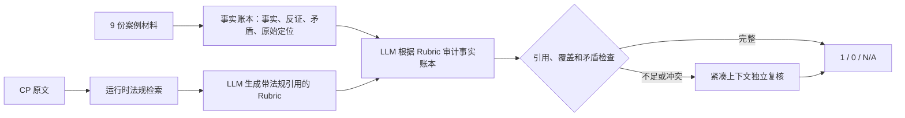

# 结构化事实账本与运行时法规 Rubric 审计方案

状态：已讨论、待实现  
日期：2026-08-04  
适用范围：FRECA Task 2，100 个逻辑案例 × 41 个 CP

## 1. 结论

最终主路径不应以多个 LLM 方法的多数投票作为 `1/0/N/A` 真值，也不应把完整法规和全案材料反复塞给模型。

建议采用：

> **每案一次结构化事实抽取 → 每 CP 运行时检索法规并生成可引用 Rubric → 基于事实账本裁决 → 仅在证据不足或冲突时复核。**

该方案把“材料阅读”与“CP 裁决”分开：前者覆盖九份材料的全部结构化字段，后者只负责把事实与当次从法规推导出的要求相匹配。



## 2. 为什么不把多方法一致直接当 baseline

现有实验结果表明，各方法不是独立裁判。

- `case_full`、`element_full` 和 `checkpoint_full` 使用同一模型、系统提示、官方法规和同一案例的完整材料，只是 CP 切分方式不同。
- 案例 001 中，`case_full` 提示约 595 KB，`checkpoint_full` 约 582 KB；`stage_audit` 单阶段请求约 613 KB，并已因模型请求失败而无法稳定完成。
- 已有重叠结果中，至少两种方法同时有结果的 451 个 case×CP 对仅 191 条一致；七种方法都有结果的 82 条中仅 8 条一致。
- 当前 `case_full` 的 656 条结果有 607 条为 `1`，明显偏宽松，且只有少数结果引用法规块。
- `automatic_retrieval` 每 CP 仅提供 12 条法规块和 12 条案例块，案例 001 的请求约 47.6 KB；它较常引用法规和反证，但会漏掉关键材料段落。

因此，一致性只能作为**稳定性信号**，不能作为真值。特别是多个方法共享同一证据盲点时，它们可能一致地错判为 `1`。

### 2.1 已观察到的三类错误

| 类型 | 案例 | 观察 |
|---|---|---|
| 检索漏召回 | case 001 / CP9 | 全量方法找到 Track 4 的 550/600 lux 照明段落并判 `1`；自动检索未召回该段而判 `0`。 |
| 裁决逻辑错误 | case 001 / CP14 | `checkpoint_full` 已引用 inspection bench 材料，却仍判 `N/A`。 |
| 全量上下文宽松 | case 001 / CP36 | `case_full` 的理由提到晚班单人检查这一风险，但仍输出 `1`；其他方法出现 `0`。 |

这些错误说明：仅增加“投票方法数”不能解决证据覆盖和裁决质量问题。

## 3. 比赛红线与方案边界

任务要求不能将某 CP 的正确规则或答案硬编码进程序/提示词。下列边界必须遵守：

- 可以：在运行时使用 CP 原文从官方法规中检索相关条款；让模型从法规片段生成当次 Rubric；保存检索、Rubric、引用和输入哈希。
- 可以：从案例材料中抽取日期、状态、数值、语言、记录、设施、矛盾等事实，并保留原始文件定位。
- 不可以：人工写出“CPx 检查 A/B/C，因此满足 A 就是 `1`”的固定映射。
- 不可以：把 Track 3 的 `Audit scenario`、`NOTE: NON-COMPLIANT` 等接近答案的字段直接映射为 CP 标签。
- 不可以：把缺件、解析失败、主体冲突直接替代业务 `0` 或 `N/A`；它们是证据质量风险，必须进入裁决上下文。

CP 文本虽短，但并不意味着法规可省略。例如 CP27 是片段式表述，是否适用及何为污染风险仍需运行时法规条款解释。正确优化是**检索相关法规**，而不是不发送法规或发送整本法规。

## 4. 每案一次：结构化事实账本

每个案例读取九份材料一次，产出只描述事实、不产出 CP 结论的账本。每条记录必须可回链到原始材料。

建议最小 schema：

```json
{
  "case_id": 1,
  "fact_id": "case-001-t3-chemical-storage-001",
  "topic": "chemical_storage",
  "claim": "chemical store is lockable and separate from grain storage",
  "value": "lockable; separated",
  "polarity": "supporting_or_contrary_not_decided",
  "source_file": "3_PestControlRecord_01_...xlsx",
  "source_id": "case-001-t3",
  "location": {"sheet": "Chemical Storage Register", "cell_range": "A1:G7"},
  "verbatim": "...",
  "quality_flags": ["identity_mismatch_if_any"]
}
```

### 4.1 优先抽取的事实类型

- 注册：业务范围、注册状态、暂停/到期、负责人、地址、变更记录。
- 设施：照明数值、洗手和厕所、排水、检查台、筛分、废弃物设施。
- 卫生与害虫：清洁计划、诱饵站状态、害虫活动、纠正措施、化学品位置和上锁状态。
- 记录：日期、留存期、语言、签名、可读性、处理/拒收记录。
- 追溯与检疫：收货、批次、库存移动、处理、发货、封签、进口国要求。
- 矛盾：同主题的相互冲突陈述、缺失记录、主体/地址/RE 不一致。

事实账本必须保留原文、表格单元格或段落定位。它不是 CP 标签表，也不能在抽取阶段把事实预判为最终合规或不合规。

## 5. 每 CP 运行时：法规 Rubric

对每个 `case_id × cp_id`：

1. 以 CP 官方原文、Element 标题作为查询种子，检索官方法规片段。
2. 让模型在当次上下文中生成 Rubric，且每一项引用法规 chunk。
3. Rubric 至少包含：适用性、待验证事实、支持条件、反证条件、例外/时间要求、需要的证据类别。
4. 依据 Rubric，从事实账本选取支持和反证事实，并可回看对应原文。
5. 模型输出 `1/0/N/A`、简短理由、法规引用、案例引用和证据覆盖状态。

Rubric 必须是运行时由官方法规推导的派生产物；可按法规版本、CP、检索结果和模型版本哈希缓存以支持复现，但不得由人工预写成答案规则。

## 6. 不使用简单加权总分

法规审计中存在一票否决事实，不能采用“80 分即合规”这种固定加权法。内部评分应只表达证据质量和复核优先级：

| 内部维度 | 用途 |
|---|---|
| 法规覆盖 | 是否引用到适用条款、例外和时间要求。 |
| 支持覆盖 | 是否有本案事实支持 Rubric 中的关键条件。 |
| 反证强度 | 是否存在直接反证、缺失或跨文档矛盾。 |
| 引用质量 | 是否同时有法规和案例原始定位。 |
| 证据完整性 | 是否有缺件、主体混入、解析失败等风险。 |

这些维度触发复核或表达置信度；最终业务标签仍由对法规和事实的当次审计产生。

## 7. 裁决与复核规则

主裁决必须满足：

- `1` / `0` 均至少包含一条法规引用和一条本案证据引用；
- `N/A` 必须解释法规适用性，而不能以“未检索到”或“材料不足”代替；
- 引用必须属于当前 `case_id`，且能回到原始文件；
- 主体冲突、缺件、矛盾进入 `quality_flags`，不直接改写业务标签。

仅在以下情形触发独立复核：

- Rubric 缺法规依据；
- 缺关键支持/反证事实；
- 事实账本存在同主题矛盾；
- 初次裁决的理由与标签不一致；
- 置信度低或引用无效。

复核必须使用紧凑的法规片段和相关事实，而不是重发完整法规与全案材料。

## 8. Baseline 的定义

人工完整标注 4,100 项不现实，因此将产物分为三类，避免错误命名：

| 名称 | 来源 | 可用于什么 | 不可用于什么 |
|---|---|---|---|
| 证据完整性 QA | Gate 0 和事实账本 | 发现缺件、冲突、污染、解析问题 | 直接充当业务 `1/0` 标签 |
| Silver 一致性集 | 不同证据视图、引用完整且一致的模型结果 | 稳定性、回归测试、选择复核样本 | 声称官方准确率或真值 |
| 生产候选结果 | 本方案全量 4,100 项输出 | 提交候选、逐项追溯 | 取代官方金标 |

“多方法一致”仅可成为 Silver 一致性集的准入条件之一。方法必须具有不同的证据视图；共享同一模型、同一全量上下文的切分方法不能被当作独立投票者。

## 9. 实施优先级

1. 定义事实账本 schema，并在现有解析产物上实现可追溯抽取。
2. 为每 CP 实现运行时法规检索和 Rubric 生成，持久化输入、输出和引用。
3. 使用事实账本进行主裁决并加入引用/适用性质量门禁。
4. 把现有 `automatic_retrieval` 作为检索基线，对照新方案；保留 `case_full`、`checkpoint_full` 为实验对照，而不是生产投票者。
5. 将 `stage_audit` 改为消费紧凑证据包后，再恢复其作为条件触发的复核能力。

## 10. 非目标

- 本文不把任何 Track 3 场景文本转换为 CP 标签。
- 本文不声明获得官方金标或可报告真实准确率。
- 本文不要求每个案例跑八种流程，也不以简单多数投票作为最终答案。
